<div align="center">

# UKIP

**Universal Knowledge Intelligence Platform**

[](https://www.python.org/)
[](https://fastapi.tiangolo.com/)
[](https://react.dev/)
[](https://nextjs.org/)
[](https://tailwindcss.com/)
[](https://duckdb.org/)
[](https://www.trychroma.com/)
[](backend/tests/)
[](LICENSE)

A domain-agnostic intelligence platform that ingests raw data, harmonizes it, enriches it against global knowledge bases, runs OLAP analytics and stochastic simulations, builds entity relationship graphs, and lets you query everything through an agentic RAG-powered AI assistant — with custom dashboards, scheduled reports, Slack/Teams alerts, and a public API ecosystem.

[Features](#features) · [Quick Start](#quick-start) · [Architecture](#architecture) · [API](#api-overview) · [Roadmap](#roadmap) · [Strategic Vision](docs/EVOLUTION_STRATEGY.md)

</div>

---

## Why UKIP?

Most data platforms force you to choose: clean your data **or** analyze it. UKIP does both in a single pipeline. It started as a catalog deduplication tool and evolved into a full research intelligence engine across **101 development sprints**.

**What it does:**

1. **Ingest** any structured data (Excel, CSV, JSON-LD, XML, BibTeX, RIS, Parquet) through a 5-step wizard with AI-assisted column mapping or direct API.
2. **Harmonize** messy records with fuzzy matching, authority resolution against 5 global knowledge bases (Wikidata, VIAF, ORCID, DBpedia, OpenAlex), and bulk normalization rules.
3. **Enrich** every record against academic APIs (OpenAlex, Google Scholar, Web of Science, Scopus) and custom **web scraper** configs using CSS/XPath selectors.
4. **Graph** relationships between entities — citations, authorship, membership, and semantic links — with BFS subgraph traversal and SVG visualization.
5. **Analyze** with OLAP cubes (DuckDB), Monte Carlo simulations, topic modeling, correlation analysis, and I+D ROI projections.
6. **Query** your entire dataset in natural language — either through the agentic RAG assistant or the **NLQ engine** that translates plain English directly to OLAP queries.
7. **Build dashboards** — each user gets a personal workspace with drag-and-drop widget panels, 8 widget types, and persistent layouts.
8. **Automate** with scheduled reports (PDF/Excel/HTML delivered by email on any cadence), Slack/Teams/Discord push alerts for 8 platform events, and cron-style data imports from connected stores.
9. **Integrate** programmatically through long-lived **API Keys** with scope control (`read`/`write`/`admin`) — zero friction for developer ecosystems.
10. **Collaborate** through threaded comments with emoji reactions and resolve workflows, full RBAC (4 roles), role-aware UI, and outbound webhooks.
11. **Observe** every action through a real-time audit log, notification center, and HTTP-level audit middleware.
12. **Scale** with multi-tenant **Organizations** — users belong to orgs, roles scoped per org, plan tiers (free/pro/enterprise).
13. **Present** data instantly with the **Sales Deck** generator — live HTML narrative printable to PDF for prospects and stakeholders.

### Design Philosophy

One rule: **Justified Complexity** ([details](docs/ARCHITECTURE.md)).

- Monorepo (FastAPI + Next.js). No microservices until proven necessary.
- If a dictionary solves it, we use a dictionary.
- Accessible for beginners, robust for production data tasks.

---

## Features

### Data Operations
- **Entity Catalog** — Browse, search, inline-edit, and delete records across any domain. Universal schema (`primary_label`, `secondary_label`, `canonical_id`, `entity_type`, `domain`). Dynamic pagination, FTS5 full-text search.
- **Entity Detail Page** — Dedicated route (`/entities/:id`) with six tabs: Overview (inline editing + quality score), Enrichment (Monte Carlo chart + concepts), Authority (candidate review), Comments (threaded annotations), Graph (relationship network + metrics strip), and Quality.
- **Entity Relationship Graph** — Typed, weighted directed edges (`cites`, `authored-by`, `belongs-to`, `related-to`). BFS subgraph traversal up to depth 2. SVG radial visualization with color-coded edge types, directional arrows, and hover tooltips.
- **Entity Quality Score** — 0.0–1.0 composite index: field completeness (40%), enrichment coverage (30%), confirmed authority (20%), relationship count (10%). Tri-color badge, `min_quality` filter, quality sort, and bulk recompute.
- **Graph Analytics Dashboard** — Whole-graph KPIs, top-10 PageRank leaderboard, degree centrality table, and BFS Path Finder.
- **Entity Linker** — Fuzzy pairwise duplicate detection, side-by-side comparison, merge (winner absorbs loser), and dismiss with persistence.
- **Bulk Import Wizard** — 5-step guided import with drag-and-drop, auto-preview, column auto-mapping, and **AI Suggest** LLM-assisted field mapping.
- **Multi-format Import/Export** — Excel, CSV, JSON, XML, BibTeX, RIS, Parquet, RDF/TTL.
- **Knowledge Graph Export** — GraphML (Gephi/yEd), Cytoscape JSON, JSON-LD with optional domain filter.
- **Domain Registry** — Custom schemas via YAML (Science, Healthcare, Business, or your own).
- **Demo Mode** — One-click seed of 1,000 demo entities with guided tour autostart.

### Data Quality
- **Fuzzy Disambiguation** — `token_sort_ratio` + Levenshtein grouping of typos, casings, and synonyms.
- **Authority Resolution Layer** — Weighted ARL scoring engine resolves against Wikidata, VIAF, ORCID, DBpedia, and OpenAlex. Batch resolution queue, bulk confirm/reject, evidence tracking.
- **Harmonization Pipeline** — Universal normalization steps with full undo/redo history.
- **Dynamic Faceting** — Filter the entity table by any field (entity type, domain, validation status, enrichment status, source) with live facet counts. Collapsible `FacetPanel` sidebar, active-facet pills, and clear-all button.
- **Clustering Algorithms** — Four grouping strategies for disambiguation: `token_sort` (Levenshtein), `fingerprint` (NFD normalize + sort tokens), `n-gram Jaccard` (bigram similarity), and `phonetic` (Cologne Phonetic + simplified Metaphone). All stdlib-only, no external ML. Algorithm selector with hover tooltips in the disambiguation UI.
- **Column Transformations** — Safe mini-language (`trim`, `upper`, `lower`, `title`, `replace`, `prefix`, `suffix`, `strip_html`, `to_number`, `slice`, `split[n]`, `strip`) applied in bulk to 8 transformable entity fields. Preview before/after diff, confirmation modal, transformation history panel. Zero `eval()`/`exec()` — expression evaluated by a hand-written parser.
- **Web Scraper Enrichment** — Define URL-based enrichment sources with CSS or XPath selectors. The scraper uses `httpx` + `lxml`, enforces per-config rate limiting, integrates with the circuit breaker, and falls back from academic APIs automatically. CRUD UI with live test panel and bulk run endpoint.

### Analytics & Intelligence
- **Natural Language Query (NLQ)** — Ask your data in plain English. The active LLM translates the question to an OLAP query (`group_by` + `filters`), validates dimension names, and returns live results — with a "Edit in OLAP Explorer →" shortcut and 6 example question chips.
- **OLAP Cube Explorer** — DuckDB-powered multi-dimensional queries with drill-down navigation, 50-row pagination, and Excel pivot export.
- **Monte Carlo Citation Projections** — Geometric Brownian Motion model simulates 5,000 citation trajectories per record.
- **ROI Calculator** — Monte Carlo I+D projection engine. Returns P5–P95 percentiles, break-even probability, year-by-year ROI, and distribution histogram.
- **Topic Modeling** — Concept frequency, co-occurrence (PMI), topic clusters, and Cramér's V field correlations.
- **Executive Dashboard** — KPI summary cards, 7-day activity area chart, secondary label × domain heatmap, top concepts cloud, top entities table — with auto-refresh (5 min countdown) and "Export Dashboard → PDF" button.
- **Knowledge Gap Detector** — Automated 4-check scan (enrichment holes, authority backlog, concept density, dimension completeness), severity-rated with recommended actions.

### Custom Dashboards
- **Personal Dashboards** — Each user can create multiple named dashboards. One is marked as **default** and loads on entry.
- **8 Widget Types** — EntityKPI, EnrichmentCoverage (donut), TopEntities table, TopBrands bar chart, ConceptCloud, RecentActivity feed, QualityHistogram, OlapSnapshot.
- **Drag-to-Reorder** — HTML5 drag-and-drop on a 12-column CSS grid. Widgets can be 4, 6, 8, or 12 columns wide.
- **Widget Picker Modal** — Catalogue of all widget types with icons, labels, and descriptions. Click to add.
- **Edit / Save / Cancel** toolbar with unsaved-changes guard on dashboard switching.
- **User isolation** — Each user sees only their own dashboards; cross-user access returns 404.

### Automation & Delivery
- **Scheduled Reports** — Create recurring report schedules (hourly to weekly). Automatically generate PDF, Excel, or HTML reports and deliver them as email attachments to one or more recipients. Background scheduler thread (60s poll loop). Manual "Send Now" trigger. Pause/Resume toggle. Full error tracking with inline error detail.
- **Scheduled Imports** — Background thread imports from connected stores on configurable intervals (5 min to 7 days).
- **Alert Channels** — Push platform events to Slack, Microsoft Teams, Discord, or any generic webhook. Platform-native payloads (Block Kit for Slack, MessageCard for Teams, embeds for Discord). 8 subscribable event types. Webhook URLs encrypted at rest (Fernet). "Test" button fires a real delivery.
- **Event Catalogue** — `entities.imported`, `enrichment.completed`, `harmonization.applied`, `quality.low`, `report.sent`, `report.failed`, `import.scheduled`, `disambiguation.resolved`.

### Public API Keys
- **Key Generation** — `ukip_<40 random chars>`. Shown exactly once at creation time.
- **Secure Storage** — Only `key_prefix` (first 16 chars) + SHA-256 hash stored. Full key never persists in the database.
- **Transparent Auth** — `Authorization: Bearer ukip_...` works everywhere a JWT works. The `get_current_user()` dependency auto-detects key vs JWT.
- **Scopes** — `read` / `write` / `admin`. Expiry dates. Last-used timestamp tracking.
- **User Isolation** — Each user sees only their own keys. Cross-user revoke returns 404.
- **Developer UX** — Green "copy now" banner on creation, `curl` example in the UI.

### Artifact Studio
- **Report Builder** — Self-contained HTML/PDF/Excel/PowerPoint reports generated server-side.
- **Report Templates** — 4 built-in presets + custom template CRUD.
- **PowerPoint Export** — Branded 16:9 PPTX via `python-pptx`.
- **Artifact Studio Hub** (`/artifacts`) — Unified gateway with live gap counts and template library.

### Context Engineering & Agentic AI
- **Analysis Contexts** — Snapshot and restore domain state for LLM sessions.
- **Tool Registry** — Register, version, and invoke tool schemas from the UI.
- **Context-Aware RAG** — RAG queries enriched with active domain context and tool invocation history.
- **Agentic Tool Loop** — RAG assistant autonomously calls tools mid-reasoning (OpenAI tool-use, Anthropic tool_use, local fallback). Returns `tools_used`, `iterations`, and agentic flag. Togglable per-query.

### Collaborative Features
- **Threaded Annotations** — Comment on any entity or authority record. One-level reply threading. Edit/delete your own comments (admins can delete any). Full RBAC.
- **Emoji Reactions** — 7 reaction types (👍 ❤️ 🚀 👀 ✅ 😄 🎉) per annotation with per-user toggle. Reaction bar with live counts displayed inline.
- **Resolve Workflow** — Mark annotation threads as resolved/unresolved (editor+). Resolved badge on thread header, stats endpoint with `total_threads`, `resolved`, `unresolved`, and `total_reactions`.
- **Comments Tab** — Integrated into the entity detail page with live count badge.
- **Multi-tenant Organizations** — Users belong to orgs with plan tiers (free/pro/enterprise), scoped membership roles (owner/admin/member), and organization switching.

### Full-Text Search
- **SQLite FTS5 index** covering entities, authority records, and annotations.
- **Global search bar** in the header with debounced live dropdown (6 results) and keyboard navigation.
- **Search page** (`/search`) with type filter pills, ranked result cards, and pagination.

### Observability & Automation
- **Audit Log** — HTTP-level middleware captures every mutating request. Frontend timeline at `/audit-log` with stats bar, 7-day sparkline, filter bar, and CSV export.
- **Activity Feed** — Real-time audit timeline on the home dashboard. Auto-refreshes every 30 seconds.
- **Webhooks** — Outbound HTTP callbacks with HMAC-SHA256 signing, delivery history, and test ping.
- **Notification Center** — Per-user read/unread state, action links, bulk mark-all-read, bell badge with live unread count.
- **Branding** — Configurable platform name, accent color, footer text, and **Logo Drag & Drop** (PNG/SVG/WebP/JPEG/GIF, 2 MB cap), propagated globally via `BrandingContext`.

### Scientometric Enrichment
Four-phase cascading enrichment worker:

| Phase | Source | Access |
|-------|--------|--------|
| 1 | [OpenAlex](https://openalex.org/) | Free (polite `mailto:` mode) |
| 2 | Google Scholar | Scraping via rotating proxies |
| 3 | [Web of Science](https://clarivate.com/) | BYOK (institutional API key) |
| 4 | [Scopus](https://www.elsevier.com/products/scopus) | BYOK (Elsevier institutional key) |
| 5 | Web Scraper | Custom CSS/XPath per-site configs with rate limiting |

### Semantic RAG Assistant
- **6 LLM providers** with BYOK support:

  | Provider | Models |
  |----------|--------|
  | OpenAI | gpt-4o, gpt-4o-mini |
  | Anthropic | claude-3.5-sonnet, claude-3-haiku |
  | DeepSeek | deepseek-chat, deepseek-reasoner |
  | xAI | grok-3, grok-3-mini |
  | Google | gemini-2.0-flash, gemini-pro |
  | Local | Any Ollama/vLLM model (free) |

- **ChromaDB** vector store with OpenAI or local `all-MiniLM-L6-v2` embeddings.
- Natural language queries return grounded, source-attributed answers with similarity scores.
- **Agentic mode** — toggle function calling per query; the model autonomously invokes catalog tools.

### User & Profile Management
- **User Management UI** — `/settings/users` (super_admin only): stats cards, search + filters, inline role assignment, activate/deactivate.
- **Personal Profile Page** — Avatar upload (canvas center-crop to 200×200 JPEG), display name, email, bio, password change.
- **Password Strength Indicator** — Real-time 4-segment bar with criteria checklist.

### Security
- **JWT + API Key authentication** — both accepted transparently via `Authorization: Bearer`.
- **Role-based access control** — `super_admin`, `admin`, `editor`, `viewer`.
- **Account lockout** after 5 failed login attempts (15-minute window).
- **AES/Fernet encryption** for credentials and webhook URLs at rest.
- **Circuit breaker** pattern for external API resilience.
- **Rate limiting** via SlowAPI on authentication endpoints.

### Interface
- **Responsive UI** — Full mobile support with slide-over sidebar, hamburger navigation.
- **Dark mode** — System-aware theme with manual toggle.
- **Guided Tour** — 5-step interactive overlay autostarted on demo seed (localStorage persistence).
- **GA4 Analytics** — Optional `NEXT_PUBLIC_GA_ID` for pageview and event tracking.
- **i18n** — English and Spanish interface with per-component translation keys.

---

## Tech Stack

| Layer | Technology |
|-------|------------|
| **API** | Python 3.10+, FastAPI, SQLAlchemy ORM |
| **Database** | SQLite + FTS5 (OLTP), DuckDB (OLAP cubes), ChromaDB (vectors) |
| **Matching** | thefuzz + python-Levenshtein |
| **Enrichment** | openalex-py, scholarly, httpx, Scopus API |
| **Analytics** | numpy, scipy, DuckDB SQL (CUBE/ROLLUP/GROUPING SETS) |
| **NLP** | LDA topic modeling, sentence-transformers |
| **AI/RAG** | openai, anthropic, ChromaDB, sentence-transformers, function calling |
| **Export** | openpyxl (Excel), WeasyPrint (PDF), python-pptx (PowerPoint) |
| **Notifications** | smtplib + TLS STARTTLS (email), urllib (Slack/Teams/Discord webhooks) |
| **Migrations** | Alembic (revision-based schema migrations, render_as_batch for SQLite) |
| **Frontend** | Next.js 16, React 19, TypeScript 5, Tailwind CSS 4, Recharts |

---

## Quick Start

### Prerequisites
- [Python 3.10+](https://www.python.org/downloads/)
- [Node.js 18+](https://nodejs.org/)

### 1. Clone and install

```bash
git clone https://github.com/keilynrp/universal-knowledge-intelligence-platform.git
cd universal-knowledge-intelligence-platform
```

### 2. Backend

```bash
python -m venv .venv

# Windows
.venv\Scripts\activate
# macOS / Linux
source .venv/bin/activate

pip install -r requirements.txt
uvicorn backend.main:app --reload
```

API at `http://localhost:8000` — Swagger UI at `http://localhost:8000/docs`

### 3. Frontend

```bash
cd frontend
npm install
npm run dev
```

Open `http://localhost:3004`

### 4. (Optional) Configure providers

- **AI Assistant**: Go to **Integrations > AI Language Models** and add your API key. For zero-cost: install [Ollama](https://ollama.ai) and point to `http://localhost:11434/v1`.
- **Email / Scheduled Reports**: Configure SMTP in **Settings → Notifications**.
- **Slack/Teams Alerts**: Go to **Settings → Alert Channels** and paste your incoming webhook URL.
- **API Keys**: Go to **Settings → API Keys** and generate a programmatic access token.
- **Web of Science / Scopus**: Set `WOS_API_KEY` / `SCOPUS_API_KEY` as environment variables.
- **Google Analytics**: Set `NEXT_PUBLIC_GA_ID` in `frontend/.env.local`.

### 5. Run tests

```bash
python -m pytest backend/tests/ -x -q
# 1330 tests, all passing
```

---

## Architecture

```mermaid
graph TD
    A[Excel / CSV / BibTeX / RIS / JSON-LD] -->|Import Wizard + AI Mapping| B[(SQLite + FTS5)]
    B --> C{Disambiguation}
    C -->|Fuzzy Match| D[Authority Resolution]
    D -->|Wikidata, VIAF, ORCID, DBpedia, OpenAlex| E[Review Queue]
    E -->|Confirm / Reject| F[Normalization Rules]
    F -->|Apply Bulk| B

    B -->|Duplicate Pairs| LNK[Entity Linker]
    LNK -->|Merge / Dismiss| B

    B -->|Relationships| GRP[Relationship Graph]
    GRP -->|BFS Subgraph| GVIS[SVG Visualization]

    B -->|Queued Records| H[Enrichment Worker]
    H -->|Phase 1| I[OpenAlex]
    H -->|Phase 2| J[Google Scholar]
    H -->|Phase 3| K[Web of Science]
    H -->|Phase 4| SC[Scopus]
    I & J & K & SC --> B

    B -->|Star Schema| OLAP[(DuckDB Cubes)]
    OLAP --> AN[OLAP Explorer]
    OLAP -->|NLQ| NLQ_E[NL Query Engine]
    B -->|Citation Data| MC[Monte Carlo Engine]
    MC --> AN
    B --> TM[Topic Modeling]
    TM --> AN
    B -->|I+D Params| ROI[ROI Calculator]
    ROI --> AN
    B --> GAP[Gap Detector]
    GAP --> ART[Artifact Studio]

    B -->|Enriched Text| VDB[(ChromaDB)]
    VDB -->|Retrieval| RAG[RAG Engine]
    CTX[Context Registry] --> RAG
    TR[Tool Registry] -->|Function Calling| RAG
    LLM[LLM Provider] --> RAG
    RAG --> CHAT[Agentic AI Chat]

    B -->|Mutations| MW[Audit Middleware]
    MW --> AUD[(audit_logs)]
    AUD --> FEED[Activity Feed]
    AUD --> WH[Webhooks]
    AUD --> AUDUI[Audit Log UI]
    AUD --> ALRT[Alert Channels]
    ALRT -->|Slack/Teams/Discord| EXT[External Services]

    B -->|FTS5 Index| SRCH[Search Engine]
    SRCH --> GSRCH[Global Search Bar]

    B -->|Section Data| RPT[Report Builder]
    RPT -->|PPTX| PPT[PowerPoint]
    RPT -->|Schedule| SRPT[Scheduled Reports]
    SRPT -->|Email SMTP| MAIL[Recipients]

    USR[(Users + API Keys)] --> AUTH[Auth Layer]
    AUTH -->|JWT or ukip_ key| API[All Endpoints]
    ORG[(Organizations)] -->|Membership| USR

    DASH[Custom Dashboards] -->|Widgets| B
    DASH -->|Widgets| OLAP

    OLAP -->|TTL Cache 300s| CACHE[Analytics Cache]
    B -->|TTL Cache 120s| CACHE

    SDECK[Sales Deck] -->|Live KPIs| B

    classDef db fill:#f9f,color:#000,stroke:#333,stroke-width:2px;
    class B,VDB,OLAP,AUD,USR db;
    classDef api fill:#ffd700,color:#000,stroke:#333,stroke-width:2px;
    class I,J,K,SC api;
    classDef ai fill:#c7d2fe,color:#1e1b4b,stroke:#818cf8,stroke-width:2px;
    class RAG,LLM,CHAT,CTX,TR,NLQ_E ai;
    classDef analytics fill:#bbf7d0,color:#14532d,stroke:#4ade80,stroke-width:2px;
    class MC,AN,TM,ROI,GAP analytics;
    classDef obs fill:#fed7aa,color:#7c2d12,stroke:#f97316,stroke-width:2px;
    class AUD,FEED,WH,RPT,AUDUI,SRCH,ALRT obs;
    classDef new fill:#ddd6fe,color:#4c1d95,stroke:#7c3aed,stroke-width:2px;
    class DASH,SRPT,MAIL,AUTH,EXT,ORG,SDECK new;
    classDef perf fill:#e0f2fe,color:#075985,stroke:#38bdf8,stroke-width:2px;
    class CACHE perf;
```



---

## API Overview

200+ endpoints across 33 functional routers. Full interactive docs at `/docs` (Swagger) or `/redoc`.

### Authentication & Users
| Method | Endpoint | Description |
|--------|----------|-------------|
| `POST` | `/auth/token` | Login (OAuth2 password flow) |
| `GET` | `/users/me` | Current user profile |
| `PATCH` | `/users/me/profile` | Update display name, email, bio |
| `POST` | `/users/me/password` | Change password |
| `POST` | `/users/me/avatar` | Upload avatar (base64 data URL) |
| `DELETE` | `/users/me/avatar` | Remove avatar |
| `GET` | `/users/stats` | User count stats by role/status (super_admin) |
| `POST` | `/users` | Create user (super_admin) |
| `PUT` | `/users/{id}` | Update user email, role, or status |
| `DELETE` | `/users/{id}` | Soft-deactivate user |

### API Keys
| Method | Endpoint | Description |
|--------|----------|-------------|
| `GET` | `/api-keys` | List your API keys (never exposes full key) |
| `POST` | `/api-keys` | Generate key — full `ukip_…` returned once only |
| `DELETE` | `/api-keys/{id}` | Revoke key (immediate effect) |
| `GET` | `/api-keys/scopes` | Available scope definitions |

### Entity Catalog
| Method | Endpoint | Description |
|--------|----------|-------------|
| `GET` | `/entities` | List entities (search, pagination, quality filter) |
| `GET` | `/entities/{id}` | Single entity detail |
| `PUT` | `/entities/{id}` | Update entity fields (editor+) |
| `DELETE` | `/entities/{id}` | Delete entity (editor+) |
| `DELETE` | `/entities/bulk` | Bulk delete by ID list |
| `POST` | `/entities/bulk-update` | Batch field update |
| `POST` | `/upload/preview` | Parse file — returns format, columns, auto-mapping |
| `POST` | `/upload/suggest-mapping` | LLM-assisted column mapping |
| `POST` | `/upload` | Import file with domain + field mapping |
| `GET` | `/export` | Export catalog to Excel |
| `GET` | `/stats` | Aggregated system statistics |

### Knowledge Graph
| Method | Endpoint | Description |
|--------|----------|-------------|
| `GET` | `/entities/{id}/graph` | BFS subgraph (`?depth=1\|2`, max 50 nodes) |
| `GET` | `/entities/{id}/relationships` | List all edges for an entity |
| `POST` | `/entities/{id}/relationships` | Create typed relationship |
| `DELETE` | `/relationships/{rel_id}` | Delete relationship |
| `GET` | `/export/graph` | Export full graph (`?format=graphml\|cytoscape\|jsonld`) |

### OLAP & Analytics
| Method | Endpoint | Description |
|--------|----------|-------------|
| `GET` | `/cube/dimensions/{domain}` | Available OLAP dimensions |
| `POST` | `/cube/query` | Multi-dimensional cube query |
| `GET` | `/cube/export/{domain}` | Export pivot table to Excel |
| `POST` | `/nlq/query` | **Natural language → OLAP** (LLM-translated) |
| `GET` | `/analyzers/topics/{domain}` | Concept frequency and co-occurrence |
| `GET` | `/analyzers/clusters/{domain}` | Topic cluster analysis |
| `GET` | `/analyzers/correlation/{domain}` | Cramér's V field correlations |
| `POST` | `/analytics/roi` | Monte Carlo I+D ROI simulation |
| `GET` | `/dashboard/summary` | Executive dashboard KPIs + heatmap |

### Custom Dashboards
| Method | Endpoint | Description |
|--------|----------|-------------|
| `GET` | `/dashboards` | List your dashboards (user-scoped) |
| `POST` | `/dashboards` | Create dashboard with widget layout |
| `GET` | `/dashboards/{id}` | Get single dashboard |
| `PUT` | `/dashboards/{id}` | Update name / layout |
| `DELETE` | `/dashboards/{id}` | Delete (auto-promotes next to default) |
| `POST` | `/dashboards/{id}/default` | Set as default |
| `GET` | `/dashboards/widget-types` | Available widget type catalogue |

### Scheduled Reports
| Method | Endpoint | Description |
|--------|----------|-------------|
| `GET` | `/scheduled-reports` | List schedules (admin+) |
| `POST` | `/scheduled-reports` | Create recurring report schedule |
| `PUT` | `/scheduled-reports/{id}` | Update name, format, interval, recipients |
| `DELETE` | `/scheduled-reports/{id}` | Delete schedule |
| `POST` | `/scheduled-reports/{id}/trigger` | Send report immediately |

### Alert Channels
| Method | Endpoint | Description |
|--------|----------|-------------|
| `GET` | `/alert-channels` | List channels (admin+) |
| `POST` | `/alert-channels` | Create Slack/Teams/Discord/webhook channel |
| `PUT` | `/alert-channels/{id}` | Update channel config or event subscriptions |
| `DELETE` | `/alert-channels/{id}` | Delete channel |
| `POST` | `/alert-channels/{id}/test` | Fire test message to channel |
| `GET` | `/alert-channels/events` | Available event catalogue |

### Report Builder
| Method | Endpoint | Description |
|--------|----------|-------------|
| `GET` | `/reports/sections` | List available report sections |
| `POST` | `/reports/generate` | Generate HTML report |
| `POST` | `/exports/pdf` | Export report as PDF (WeasyPrint) |
| `POST` | `/exports/excel` | Export branded 4-sheet workbook |
| `POST` | `/exports/pptx` | Export branded 16:9 PowerPoint |

### Notification Center
| Method | Endpoint | Description |
|--------|----------|-------------|
| `GET` | `/notifications/center` | Paginated feed with `is_read` flag |
| `GET` | `/notifications/center/unread-count` | Fast unread count for bell badge |
| `POST` | `/notifications/center/read-all` | Mark all entries read |

### Organizations
| Method | Endpoint | Description |
|--------|----------|-------------|
| `POST` | `/organizations` | Create organization (any authenticated user) |
| `GET` | `/organizations` | List organizations you belong to |
| `GET` | `/organizations/{id}` | Get org detail |
| `PUT` | `/organizations/{id}` | Update name/description/plan (owner/admin) |
| `DELETE` | `/organizations/{id}` | Soft-delete org (owner only) |
| `GET` | `/organizations/{id}/members` | List org members |
| `POST` | `/organizations/{id}/members` | Invite user by username |
| `DELETE` | `/organizations/{id}/members/{user_id}` | Remove member |
| `POST` | `/organizations/{id}/switch` | Switch active org context |

### Sales Deck
| Method | Endpoint | Description |
|--------|----------|-------------|
| `GET` | `/exports/sales-deck` | Self-contained print-ready HTML sales deck (open → Print → PDF) |
| `GET` | `/exports/sales-deck/data` | Live KPI payload used by the sales deck |

### Web Scrapers & Transformations
| Method | Endpoint | Description |
|--------|----------|-------------|
| `POST` | `/scrapers` | Create scraper config (admin+) |
| `GET` | `/scrapers` | List scraper configs |
| `PUT` | `/scrapers/{id}` | Update scraper config |
| `DELETE` | `/scrapers/{id}` | Delete scraper config |
| `POST` | `/scrapers/{id}/test` | Dry-run scraper against a sample label |
| `POST` | `/scrapers/{id}/run` | Bulk-enrich up to 500 entities |
| `GET` | `/entities/facets` | Field-value counts for facet sidebar |
| `POST` | `/transformations/preview` | Preview transformation on 20 sample records |
| `POST` | `/transformations/apply` | Bulk-apply transformation to entity field |
| `GET` | `/transformations/history` | Last transformations applied |

*(Full table of all 200+ endpoints available in `/docs`)*

---

## Project Structure

<details>
<summary>Click to expand</summary>

```
ukip/
├── backend/
│   ├── adapters/                  # Store + enrichment + LLM adapters
│   ├── analytics/
│   │   ├── rag_engine.py          # RAG orchestration (standard + agentic tool loop)
│   │   └── vector_store.py        # ChromaDB vector store
│   ├── analyzers/
│   │   ├── topic_modeling.py      # Concept frequency, co-occurrence, PMI
│   │   ├── correlation.py         # Cramér's V multi-variable analysis
│   │   ├── roi_calculator.py      # Monte Carlo I+D ROI simulation
│   │   └── gap_detector.py        # Knowledge gap analysis engine
│   ├── authority/
│   │   ├── resolver.py            # Parallel authority resolution (5 sources)
│   │   ├── scoring.py             # Weighted ARL scoring engine
│   │   └── resolvers/             # Wikidata, VIAF, ORCID, DBpedia, OpenAlex
│   ├── domains/                   # YAML domain schemas
│   ├── exporters/
│   │   ├── excel_exporter.py      # Branded 4-sheet Excel workbook
│   │   └── pptx_exporter.py       # Branded 16:9 PowerPoint (python-pptx)
│   ├── notifications/
│   │   ├── email_sender.py        # SMTP email + report attachment delivery
│   │   └── alert_sender.py        # Slack/Teams/Discord/webhook push alerts
│   ├── parsers/
│   │   ├── bibtex_parser.py       # BibTeX → universal records
│   │   ├── ris_parser.py          # RIS → universal records
│   │   └── science_mapper.py      # Science record → UniversalEntity fields
│   ├── routers/                   # 33 domain routers (200+ endpoints)
│   │   ├── ai_rag.py              # RAG index/query/stats + agentic mode
│   │   ├── alert_channels.py      # Slack/Teams/Discord alert channels CRUD
│   │   ├── analytics.py           # Dashboard, OLAP, ROI, topic analyzers
│   │   ├── annotations.py         # Collaborative threaded comments
│   │   ├── api_keys.py            # API key generation, listing, revocation
│   │   ├── artifacts.py           # Gap detector + report templates
│   │   ├── audit_log.py           # Audit timeline, stats, CSV export
│   │   ├── auth_users.py          # JWT auth + RBAC + avatar + profile
│   │   ├── authority.py           # Authority resolution + review queue
│   │   ├── branding.py            # Platform branding + logo upload/delete
│   │   ├── context.py             # Context sessions + tool registry
│   │   ├── dashboards.py          # Per-user custom dashboards CRUD
│   │   ├── demo.py                # Demo seed/reset
│   │   ├── disambiguation.py      # Fuzzy field grouping + rules
│   │   ├── domains.py             # Domain schema CRUD
│   │   ├── entities.py            # Entity CRUD + pagination + bulk ops
│   │   ├── entity_linker.py       # Duplicate detection + merge/dismiss
│   │   ├── graph_export.py        # Knowledge graph export
│   │   ├── harmonization.py       # Universal normalization pipeline
│   │   ├── ingest.py              # Import wizard + AI suggest-mapping + export
│   │   ├── nlq.py                 # Natural Language → OLAP query engine
│   │   ├── notifications.py       # Notification center
│   │   ├── quality.py             # Entity quality score computation
│   │   ├── relationships.py       # Entity relationship graph CRUD + BFS
│   │   ├── reports.py             # HTML/PDF/Excel/PPTX report generation
│   │   ├── scheduled_imports.py   # Cron-style store import scheduler
│   │   ├── scheduled_reports.py   # Recurring email report scheduler
│   │   ├── search.py              # FTS5 global search + index rebuild
│   │   ├── stores.py              # Store connector management
│   │   ├── organizations.py       # Multi-tenant org CRUD + member management
│   │   ├── sales_deck.py          # Sales deck HTML + data endpoints
│   │   ├── scrapers.py            # Web scraper configs CRUD + test + run
│   │   ├── transformations.py     # Column transformation preview/apply/history
│   │   └── webhooks.py            # Outbound webhook CRUD + delivery
│   ├── tests/                     # 1330 tests across 52 files
│   ├── audit.py                   # AuditMiddleware (HTTP-level interception)
│   ├── auth.py                    # JWT + API Key + RBAC + account lockout
│   ├── circuit_breaker.py         # External API resilience
│   ├── clustering/                # Clustering algorithms (fingerprint, ngram, phonetic)
│   └── transformations/           # Safe expression engine for bulk column transforms
│   ├── encryption.py              # Fernet credential encryption
│   ├── main.py                    # FastAPI app (slim orchestrator)
│   ├── models.py                  # SQLAlchemy ORM (29 tables)
│   ├── olap.py                    # DuckDB OLAP engine
│   ├── report_builder.py          # Section builders for reports
│   ├── schema_registry.py         # Dynamic domain schema loader
│   └── tool_registry.py           # Tool schema registry + invocation
├── frontend/
│   ├── app/
│   │   ├── analytics/
│   │   │   ├── dashboard/         # Executive Dashboard (auto-refresh, PDF export)
│   │   │   ├── graph/             # Graph Analytics + Export panel
│   │   │   ├── nlq/               # Natural Language Query page
│   │   │   ├── olap/              # OLAP Cube Explorer
│   │   │   ├── topics/            # Topic Modeling & Correlations
│   │   │   ├── roi/               # ROI Calculator
│   │   │   └── page.tsx           # Intelligence Dashboard hub
│   │   ├── artifacts/
│   │   │   ├── gaps/              # Knowledge Gap Detector
│   │   │   └── page.tsx           # Artifact Studio hub
│   │   ├── audit-log/             # Audit Log timeline + CSV export
│   │   ├── authority/             # Authority review queue
│   │   ├── context/               # Context Engineering + Tool Registry
│   │   ├── dashboards/
│   │   │   ├── page.tsx           # Custom Dashboard Builder (drag-drop, widget picker)
│   │   │   └── widgets.tsx        # 8 self-fetching widget components
│   │   ├── disambiguation/        # Fuzzy disambiguation tool
│   │   ├── domains/               # Domain schema designer
│   │   ├── entities/
│   │   │   ├── [id]/              # Entity Detail (6 tabs)
│   │   │   ├── bulk-edit/         # Bulk field editor
│   │   │   └── link/              # Entity Linker
│   │   ├── harmonization/         # Data cleaning workflows
│   │   ├── transformations/       # Column Transformation UI with preview + history
│   │   ├── import/                # Bulk Import Wizard (5-step)
│   │   ├── integrations/          # Store + AI provider config
│   │   ├── notifications/         # Notification Center
│   │   ├── profile/               # Personal Profile page
│   │   ├── rag/                   # Semantic RAG chat
│   │   ├── reports/
│   │   │   ├── page.tsx           # Report Builder
│   │   │   └── scheduled/         # Scheduled Reports management
│   │   ├── scrapers/              # Web Scraper config manager + live test panel
│   │   ├── search/                # Full-text search results
│   │   ├── demo/
│   │   │   └── sales/             # Interactive Sales Deck (animated KPIs, PDF export)
│   │   ├── settings/
│   │   │   ├── alerts/            # Alert Channels (Slack/Teams/Discord)
│   │   │   ├── api-keys/          # API Key management
│   │   │   ├── organizations/     # Multi-tenant org management + member invite
│   │   │   ├── page.tsx           # App settings + branding + logo
│   │   │   └── users/             # User Management
│   │   └── components/
│   │       ├── GuidedTour.tsx         # 5-step interactive onboarding tour
│   │       ├── Header.tsx             # App header with global search + domain selector
│   │       ├── Sidebar.tsx            # Navigation with all 30+ routes
│   │       └── [30+ shared components]
│   └── lib/
│       ├── analytics.ts           # GA4 wrapper (trackEvent, trackPageView)
│       └── api.ts                 # apiFetch API client
├── data/demo/
│   └── demo_entities.xlsx         # 1,000 sample entities for demo mode
├── docs/
│   ├── ARCHITECTURE.md
│   ├── EVOLUTION_STRATEGY.md
│   └── SCIENTOMETRICS.md
└── requirements.txt
```

</details>

---

## Roadmap

### Completed ✅

| Sprints | Area | Milestone |
|---------|------|-----------|
| 1–5 | Core | Entity catalog, fuzzy disambiguation, multi-format import/export, analytics dashboard, security hardening |
| 6–9 | Enrichment | Scientometric pipeline (OpenAlex → Scholar → WoS), circuit breaker, Monte Carlo citation projections |
| 10 | RAG | Semantic RAG with ChromaDB + multi-LLM BYOK panel (6 providers) |
| 11–13 | Integrations | E-commerce adapters; HTTP 201 on creation; pagination bounds; export/upload caps |
| 14 | Security | JWT auth on all endpoints, RBAC (4 roles), account lockout, password management, role-aware UI |
| 15–16 | Authority | Authority Resolution Layer: 5 resolvers, weighted ARL scoring, evidence tracking, cross-source deduplication |
| 17a | Domains | Domain Registry with YAML-based schema designer |
| 17b | OLAP | OLAP Cube Explorer powered by DuckDB |
| 18 | Analytics | Topic modeling, PMI co-occurrence, topic clusters, Cramér's V correlations |
| 19 | Authority | ARL Phase 2: batch resolution, review queue, bulk confirm/reject |
| 20–22 | Platform | Webhook system (HMAC-SHA256); Audit Log + Activity Feed; responsive mobile UI |
| 23 | Entity UX | Entity Detail Page — 3-tab view |
| 36 | Architecture | API routers refactor — split 3,370-line `main.py` into 12 domain routers |
| 37 | Analytics | ROI Calculator — Monte Carlo I+D with P5–P95, break-even probability |
| 39 | Dashboard | Executive Dashboard — KPI cards, 7-day area chart, heatmap, concept cloud |
| 40 | Export | Enterprise export — branded Excel (4-sheet), PDF via WeasyPrint |
| 41 | Demo | Demo Mode — one-click seed of 1,000 entities |
| 42 | Collaboration | Collaborative Annotations — threaded comments with RBAC |
| 43 | Platform | In-app Notification System |
| 44 | Branding | Platform Branding — name, accent color, footer text |
| 45 | Artifacts | Knowledge Gap Detector — 4-check scan, severity rating |
| 46 | Artifacts | Strategic Report Templates — 4 built-in presets, custom template CRUD |
| 47 | Artifacts | Artifact Studio Hub + PowerPoint Export |
| 48–50 | Context | Context Engineering, Tool Registry, Context-Aware RAG |
| 51–52 | Observability | Audit Log — middleware, timeline, stats, CSV export |
| 53 | Search | Full-Text Search — FTS5 index, global search bar, `/search` page |
| 54 | Entity UX | Comments Tab — 4th tab on Entity Detail |
| 55 | Data Quality | Entity Linker — fuzzy duplicate detection, merge, dismiss |
| 56 | Notifications | Notification Center — per-user read/unread state, action links |
| 57 | Users | User Management UI — stats, search/filters, inline role assignment |
| 58 | Users | User Avatar Upload — drag & drop, canvas center-crop |
| 59 | Users | Personal Profile — display name, bio, password strength indicator |
| 60 | Webhooks | Webhooks UI Panel — delivery history, stats, test ping |
| 61 | Data Sync | Scheduled Imports — background scheduler, CRUD, management page |
| 62 | Entities | Bulk Entity Editor — multi-select, batch field picker, bulk delete |
| 63 | Enrichment | Scopus Adapter — Elsevier premium enrichment (BYOK) |
| 64 | Infrastructure | PostgreSQL/MySQL backends via `DATABASE_URL` |
| 65 | Auth | SSO Integration — OAuth2/OIDC via Authlib |
| 66–67 | Core | Universal Entity Schema — domain-agnostic model migration |
| 68 | Science | BibTeX/RIS Import — science-format parsers |
| 69a | Context | Memory Layer — persistent context snapshots |
| 69b | Context | Session Diff & Insights — LLM diff generation |
| 69c | AI | Agentic Tool Loop — LLM function calling on all adapters |
| 70 | Graph | Entity Relationship Graph — typed directed edges, SVG radial visualization |
| 71 | Import | Bulk Import Wizard — 5-step frontend wizard with `POST /upload/preview` |
| 72 | Quality | Entity Quality Score — 0.0–1.0 composite index, badge, sort, gap integration |
| 73 | Graph | Graph Analytics — PageRank, degree centrality, connected components, BFS path |
| 74 | Import | LLM-Assisted Column Mapping — `POST /upload/suggest-mapping` with AI Suggest button |
| 75 | Graph | Knowledge Graph Export — GraphML, Cytoscape JSON, JSON-LD |
| 76 | Branding | Logo Drag & Drop — multipart upload, cache-busting, global `BrandingContext` propagation |
| **77** | **UX** | **Dashboard auto-refresh (5 min countdown), Export Dashboard → PDF, OLAP virtual scroll, Guided Tour (5-step), GA4 analytics tracking** |
| **78** | **AI** | **Natural Language Query — plain English → OLAP via LLM; `POST /nlq/query`; full frontend with example chips, translation card, live results** |
| **79** | **Automation** | **Scheduled Reports by Email — PDF/Excel/HTML on any cadence (hourly to weekly); SMTP attachment delivery; background 60s scheduler; full CRUD + trigger endpoint** |
| **80** | **Retention** | **Custom Dashboard Builder — per-user named dashboards; 8 widget types; HTML5 drag-to-reorder; widget picker modal; user isolation** |
| **81** | **Alerts** | **Slack/Teams/Discord/webhook alert channels — platform-native payloads (Block Kit, MessageCard, embeds); 8 subscribable events; Fernet-encrypted URLs; Test button** |
| **82** | **Ecosystem** | **Public API Keys — `ukip_` format; SHA-256 hash storage; transparent JWT+key auth; `read`/`write`/`admin` scopes; per-user isolation; developer UX with curl example** |
| **83** | **Performance** | **In-memory TTL analytics cache (`_SimpleCache`, 300s/120s); virtual scrolling for entity tables > 50 rows (ROW_HEIGHT=52px, editing-row pinning); admin cache-invalidation endpoint; 200-row page option** |
| **84** | **Demo** | **Sales Deck generator — self-contained print-ready HTML (gradient hero, live KPIs, value props, capabilities checklist); `/demo/sales` interactive page with animated KPI counters** |
| **85** | **Multi-tenancy** | **Organizations — `Organization` + `OrganizationMember` models; slug + plan (free/pro/enterprise); 9-endpoint router (CRUD + invite/remove + switch); `/settings/organizations` management UI** |
| **86** | **Collaboration** | **Enhanced Annotations — emoji reactions (👍 ❤️ 🚀 👀 ✅ 😄 🎉) with per-user toggle; resolve/unresolve workflow (`is_resolved`, `resolved_at`); thread stats endpoint; reaction bar + resolve badge in UI** |
| **86.5** | **Infrastructure** | **Alembic Integration — replaced 150-line manual ALTER TABLE bootstrap with revision-based migrations (`alembic upgrade head`); `render_as_batch` for SQLite; `env.py` wired to all UKIP models; FTS5 shadow table exclusion; baseline migration `0001`** |
| **87** | **Data Quality** | **Dynamic Faceting — filter entity catalog by entity_type, domain, validation_status, enrichment_status, source with live counts; `FacetPanel` sidebar; active-facet pills with clear-all** |
| **88** | **Data Quality** | **Clustering Algorithms — fingerprint (NFD + token sort), n-gram Jaccard, Cologne Phonetic, simplified Metaphone — all stdlib-only; algorithm selector with tooltips in disambiguation UI; `algorithm_used` badge on group cards** |
| **89** | **Data Quality** | **Column Transformations — safe mini-language (12 functions, zero eval/exec); `POST /transformations/preview` + `/apply` + `/history`; before/after diff table; confirmation modal; transformation history panel** |
| **90** | **Enrichment** | **Web Scraper Enrichment — CSS/XPath selector-based URL scraper using httpx + lxml; per-config rate limiting; circuit breaker integration; worker fallback after academic APIs; full CRUD UI with live test panel and bulk run** |
| **91** | **Real-time** | **WebSocket Collaboration — `ConnectionManager` singleton; per-room presence tracking (join/leave/broadcast); JWT + API-key auth via query param; `useWebSocket` hook with exponential back-off; `PresenceAvatars` component; entity editing signals; dashboard live updates** |
| **92** | **Automation** | **Workflow Automation Engine — `Workflow` + `WorkflowRun` models; trigger→condition→action pipeline; 4 triggers (entity.created/enriched/flagged/manual), 4 conditions, 4 actions (webhook/tag/alert/log); visual no-code builder UI; run history panel** |
| **93** | **Ecosystem** | **Embeddable Widget SDK — `EmbedWidget` model with UUID public token; 4 data providers (entity_stats, top_concepts, recent_entities, quality_score); origin-validated public endpoints; iframe + JS snippet generator; standalone `/embed/[token]` public page** |
| **94** | **Infrastructure** | **PostgreSQL Hardening — cross-DB Alembic migrations (Boolean defaults, FTS5 → GIN index); dialect-aware search (FTS5 MATCH vs `plainto_tsquery`); Docker Compose with PostgreSQL 16-alpine + healthcheck; production-ready `Dockerfile.backend`** |
| **95** | **UX** | **Onboarding Polish — `GET /onboarding/status` auto-detects 5-step completion; `WelcomeModal` 3-slide first-login carousel (localStorage persistence); `OnboardingChecklist` collapsible progress bar; empty-state hero with Import / Try Demo CTAs on first visit** |
| **96** | **Design System** | **Unified State System — `Skeleton` (9 variants: table, card, grid, list, text); `EmptyState` (10 icon presets, 3 sizes, 6 color schemes, CTA buttons); `ErrorBanner` (inline/card/row variants, retry callback, `role="alert"`); 32 silent `console.error/warn` calls removed across 9 files** |
| **97** | **Accessibility** | **ARIA + Mobile — `useFocusTrap<T>` hook (Tab/Shift-Tab cycle, focus restore); `role="dialog"` + `aria-modal` + `aria-labelledby` on all slide-overs; `htmlFor`/`id` on every form field; `aria-label` on all icon-only buttons; `aria-hidden` on decorative SVGs; `role="log"` + `aria-live` on chat; responsive grids + padding across 6 pages** |
| **98** | **Consistency** | **Design System Adoption — `SkeletonCard` replaces local shimmer in executive dashboard; `ErrorBanner` replaces inline red divs in dashboard/import-export/audit-log; `EmptyState` replaces inline SVG+text in harmonization + notifications; silent export failure → `toast()`; `aria-hidden` sweep on remaining decorative SVGs** |

---

### All sprints complete ✅

The following sprints are proposed for the next development cycle. Each is designed to compound on the platform's strengths — real-time collaboration, ecosystem growth, and intelligence.

#### ✅ Sprint 83 — Performance Optimization
In-memory TTL analytics cache (`_SimpleCache`, 5 min / 2 min) for all expensive topic/correlation/dashboard computations. Virtual scrolling in the entities table for pages > 50 rows (ROW_HEIGHT=52px, 620px viewport, sticky thead, editing-row pinning). Admin cache-invalidation endpoint. 200-row page size option.

#### ✅ Sprint 84 — Demo-Readiness & Sales Deck
`GET /exports/sales-deck` generates a self-contained print-ready HTML page (gradient hero, live KPI cards, value props, workflow timeline, domain table, capabilities checklist) — open in browser → Print → Save as PDF for a polished sales deck. Companion `/demo/sales` interactive page with animated KPI counters.

#### ✅ Sprint 85 — Multi-tenant Organizations
`Organization` + `OrganizationMember` models with slug, plan (free/pro/enterprise), and owner/admin/member roles. `org_id` nullable FK on User (backward-compatible). 9-endpoint organizations router (CRUD + invite/remove members + `/switch`). `/settings/organizations` management UI in the platform.

#### ✅ Sprint 86 — Collaborative Annotations (Enhanced)
Annotation resolve/unresolve workflow (`is_resolved`, `resolved_at`, `resolved_by_id`). Emoji reactions (👍 ❤️ 🚀 👀 ✅ 😄 🎉) per annotation with per-user toggle. Thread statistics endpoint (`total_threads`, `resolved`, `unresolved`, `total_reactions`). UI: resolve badge, reaction bar with counts in `AnnotationThread.tsx`.

#### ✅ Sprint 86.5 — Alembic Migration System
Replaced 150 lines of manual `ALTER TABLE` bootstrap code with revision-controlled Alembic migrations. Configured `alembic.ini` + `env.py` (wired to all UKIP models, `render_as_batch` for SQLite, FTS5 shadow table exclusion). Baseline migration `0001_baseline.py` captures the full schema from Sprints 1–86. `_run_migrations()` called at every startup — idempotent and safe.

#### ✅ Sprint 87 — Dynamic Faceting
OpenRefine-inspired facet filters on the entity catalog. `GET /entities/facets` returns counts for each field value across entity_type, domain, validation_status, enrichment_status, and source. `FacetPanel` sidebar component with collapsible sections and color-coded chips. Active facets shown as dismissible pills above the table. Filtered params passed as `ft_*` query params to `GET /entities`.

#### ✅ Sprint 88 — Clustering Algorithm Suite
Extended disambiguation with four grouping strategies beyond the default Levenshtein `token_sort`:
- **fingerprint** — NFD unicode normalization + accent strip + punctuation removal + token sort. OpenRefine-equivalent key collision algorithm.
- **n-gram Jaccard** — Bigram character n-grams with Jaccard similarity (0–100 scale). Works well for short strings and typos.
- **Cologne Phonetic** — German phonetic encoding for name disambiguation (Köln/Koeln → same group).
- **Metaphone** — Simplified English/Spanish Metaphone for cross-language phonetic matching.
All implemented in pure Python stdlib — zero ML dependencies. Algorithm selector dropdown with hover tooltips in the disambiguation UI. `algorithm_used` badge on each group card.

#### ✅ Sprint 89 — Column Transformation Language
A safe, `eval()`-free mini-language for bulk field transformations. Twelve built-in functions: `trim`, `upper`, `lower`, `title`, `replace(old,new)`, `prefix(text)`, `suffix(text)`, `strip_html`, `to_number`, `slice(start,end)`, `split(sep)[n]`, `strip(chars)`. Applied to 8 transformable entity fields. Endpoints: `POST /transformations/preview` (dry-run on 20 samples), `POST /transformations/apply` (bulk write + harmonization log entry), `GET /transformations/history`. Frontend: field selector, autocomplete expression input, before/after diff table, confirmation modal, last-10 history panel.

#### ✅ Sprint 90 — Web Scraping as Enrichment Source
Custom CSS/XPath-based URL scrapers as a 5th enrichment phase. `WebScraperConfig` model stores `url_template` (with `{primary_label}` placeholder), selector type, selector, field_map JSON, and rate limit. `backend/adapters/web_scraper.py` uses `httpx` + `lxml` with per-instance rate limiting. Circuit breaker integration: scraper trips after 3 failures, recovers after 60s. Enrichment worker automatically falls back to active scrapers after academic APIs fail. Endpoints: CRUD + `POST /scrapers/{id}/test` (dry-run, no DB writes) + `POST /scrapers/{id}/run` (bulk enrich up to 500 entities). Frontend: form with URL template interpolation preview, field-map editor (index → entity field), live test panel with before/after, run button with enrichment counter.

#### ✅ Sprint 91 — WebSocket Real-time Collaboration
`ConnectionManager` singleton with per-room async presence tracking (connect/disconnect/broadcast). WebSocket endpoint `GET /ws/{room}?token=<jwt|api_key>` — supports both JWT and `ukip_` API keys via query param. Relay message types: `entity.editing`, `entity.saved`, `dashboard.updated`. Presence protocol: `presence.list`, `presence.join`, `presence.leave`. Ping/pong heartbeat (30s). Frontend: `useWebSocket` hook with exponential back-off reconnect (max 8 retries, 16s cap). `PresenceAvatars` component — colored avatar circles with initials, overflow `+N` badge, pulsing live dot. Entity Detail and Dashboards pages both broadcast real-time signals.

#### ✅ Sprint 92 — Workflow Automation Engine
No-code trigger → condition → action pipeline. `Workflow` + `WorkflowRun` models with Alembic migration. `backend/workflow_engine.py`: `fire_trigger()`, `run_workflow()`, condition evaluator, 4 action dispatchers. **Triggers**: `entity.created`, `entity.enriched`, `entity.flagged`, `manual`. **Conditions**: `field_equals`, `field_contains`, `field_empty`, `enrichment_status_is`. **Actions**: `send_webhook`, `tag_entity`, `send_alert`, `log_only`. Frontend: visual builder with trigger selector, dynamic condition rows, action rows with inline config. Run history panel, manual run dialog, active/inactive toggle. 9-endpoint CRUD router (admin+).

#### ✅ Sprint 93 — Embeddable Widget SDK
`EmbedWidget` model with UUID `public_token`, `allowed_origins`, and `view_count` tracking. Three public (no-auth) embed endpoints: `GET /embed/{token}/config`, `GET /embed/{token}/data` (origin-validated), `GET /embed/{token}/snippet` (iframe + JS embed code). Four data providers: `entity_stats`, `top_concepts`, `recent_entities`, `quality_score`. Frontend `/widgets` management page: widget creator form, grid with token display, copy/embed actions, active toggle. `EmbedPanel` with tab-switched iframe/JS snippet + one-click copy. Standalone `/embed/[token]` public page (no auth, no sidebar) with 4 chart renderers.

#### ✅ Sprint 94 — PostgreSQL Hardening
Full cross-database compatibility via dialect-aware Alembic migrations. Boolean `server_default` changed from integer literals `"1"`/`"0"` to `sa.text("true"/"false")` (PostgreSQL rejects integers for BOOLEAN DEFAULT). FTS5 virtual table replaced with dialect-conditional block: SQLite → FTS5 (unchanged), PostgreSQL → regular table + GIN index on `to_tsvector('english', ...)`. Sprints 90/92/93 migrations updated from `sqlite_master` checks to `sa.inspect(bind).has_table()` (cross-DB SQLAlchemy API). Search router detects dialect via `SQLALCHEMY_DATABASE_URL` prefix and routes to either FTS5 `MATCH` or `plainto_tsquery @@ to_tsvector`. `docker-compose.yml`: PostgreSQL 16-alpine service with healthcheck, env-var driven secrets, backend depends-on. `Dockerfile.backend`: python 3.13-slim, `alembic upgrade head` on container start.

#### ✅ Sprint 95 — Onboarding Polish
`GET /onboarding/status` auto-detects 5-step completion from existing DB tables — no new schema migration. Steps: upload entities, run enrichment, apply harmonization, create workflow, view analytics. `WelcomeModal.tsx`: 3-slide first-login carousel with gradient headers, slide-dot navigation, localStorage persistence (`ukip_welcomed_v1`). `OnboardingChecklist.tsx`: collapsible progress checklist with step icons, percent completion bar, strikethrough on done, localStorage dismiss. Home page `page.tsx`: integrates both components + empty-state hero (Import Data / Try Demo CTAs shown when entity count is 0).

#### ✅ Sprint 96 — Unified Design System (State Components)
Three new base UI components consumed everywhere: **`Skeleton`** (9 variants — `SkeletonText`, `SkeletonRow`, `SkeletonTableBody`, `SkeletonCard`, `SkeletonCardGrid`, `SkeletonList`, `SkeletonStat`, `SkeletonParagraph`, `SkeletonAvatar` — all `animate-pulse`, light + dark). **`EmptyState`** (10 icon presets, 3 sizes page/card/compact, 6 color schemes, CTA buttons/links). **`ErrorBanner`** (3 variants inline/card/row, optional retry callback, `role="alert"`). All exported from `frontend/app/components/ui/index.ts`. Applied immediately: `EntityTable` → `SkeletonTableBody` + `ErrorBanner`; topic modeling page → `SkeletonList`; classifications page → `SkeletonCardGrid` + `ErrorBanner`; integrations page → toast on all catch blocks. 32 `console.error`/`console.warn` calls removed from 9 files.

#### ✅ Sprint 97 — Accessibility + Mobile
`useFocusTrap<T>` custom hook — traps Tab/Shift-Tab inside active dialogs, restores focus to previous element on close. All slide-overs: `role="dialog"`, `aria-modal="true"`, `aria-labelledby` referencing the panel `<h2>`. All form labels: `htmlFor`/`id` explicit association. All icon-only buttons: descriptive `aria-label`. All decorative SVGs: `aria-hidden="true"`. RAG chat: `role="log"`, `aria-live="polite"` on message list; `sr-only` label on input. Mobile responsive: `grid-cols-1 md:grid-cols-3` on domain cards, `h-[calc(100vh-160px)] sm:h-[calc(100vh-200px)]` on chat, `max-w-[90%] sm:max-w-[75%]` on message bubbles, `p-3 sm:p-6` on OLAP page. Covered: Sidebar, Header, RAGChatInterface, domains, settings/users, analytics/olap.

#### ✅ Sprint 98 — Design System Consistency
Completed the design system rollout across all high-traffic pages. Executive Dashboard: local `Skeleton` function eliminated, replaced with `SkeletonCard` from the UI library; inline red error div replaced with `ErrorBanner` (with retry). Import/Export: upload error inline div → `ErrorBanner`; upload spinner → `aria-hidden`. Audit Log: `useToast` imported; silent export `catch {}` → `toast("Export failed")`; inline error text → `ErrorBanner`. Harmonization: inline SVG+text empty state → `EmptyState icon="document"`. Notifications: inline empty state → `EmptyState icon="bell"` with clear-filter CTA. Decorative SVG `aria-hidden` sweep across dashboard action buttons.

---
#### ✅ Sprint 99 — Production Infrastructure
Containerization and CI/CD hardening for production deployment.

#### ✅ Sprint 100 — Frontend Testing Foundation
Vitest + React Testing Library setup with 52 tests across 6 suites. `vitest.config.ts`: jsdom environment, `@vitejs/plugin-react`, `@/*` path alias, v8 coverage. `vitest.setup.tsx`: jest-dom matchers, `next/link`/`next/navigation` mocks. Test suites: `ui.EmptyState` (9 tests — title, description, link/button CTAs, size classes, preset icons), `ui.ErrorBanner` (7 — role=alert, retry callback across all 3 variants), `ui.Skeleton` (11 — aria-hidden on every primitive, correct row/cell/card counts), `AuthContext` (6 — login/logout flow, localStorage hydration, bad credentials), `RAGChatInterface` (7 — role=log, labeled input, query→response, error fallback), `EntityTable` (8 — skeleton/error/data/search/empty states). CI: `frontend-test` job added to `lint.yml`. `package.json`: `test`, `test:watch`, `test:coverage` scripts.

#### ✅ Sprint 101 — Final Polish
Error boundaries: root `app/error.tsx` (full-page centred error card with Try again + Go home), shared `RouteError` component, plus route-level `error.tsx` for 5 high-traffic routes (entities, analytics, rag, settings, import-export). Env-var validation extended in lifespan: required-var check for `JWT_SECRET_KEY`, `ENCRYPTION_KEY`, `ADMIN_USERNAME`, `ADMIN_PASSWORD`; insecure-default check adds `ADMIN_PASSWORD` with common weak values; `ALLOWED_ORIGINS=*` wildcard warning. `API.md` regenerated from live OpenAPI schema — 248 endpoints across 35 tags, grouped by tag with auth indicator, params, response codes, and a rate-limits table. `poweredByHeader: false` + `compress: true` already active from Sprint 99. `frontend/Dockerfile`: multi-stage Node 20 build (deps→builder→runner), non-root `nextjs` user, `output: "standalone"`, port 3004. Three GitHub Actions workflows: `test.yml` (pytest matrix Python 3.11+3.12, coverage XML artifact), `lint.yml` (ruff backend, ESLint+tsc frontend), `docker.yml` (buildx validation for both images with GHA cache). `next.config.ts`: full security header suite (CSP, X-Frame-Options, X-Content-Type-Options, X-XSS-Protection, Referrer-Policy, Permissions-Policy), `poweredByHeader: false`, `compress: true`. Backend `SecurityHeadersMiddleware` mirrors headers on all API responses. Env-var insecure-default warnings in lifespan (JWT_SECRET_KEY, SESSION_SECRET_KEY). Rate limiting via SlowAPI on 10 additional critical endpoints: `/upload`, `/enrich/row`, `/enrich/bulk`, `/stores/{id}/test`, `/stores/{id}/pull`, `/harmonization/apply-all`, `/authority/resolve`, `/disambiguate/ai-resolve`, `/nlq/query`, `/rag/query`. 1330 tests passing.


### Strategic Vision 🗺️

| Horizon | Theme | Description |
|---------|-------|-------------|
| ✅ Sprints 1–82 | Foundation | Security, enrichment, analytics, RAG, dashboards, alerts, public API ecosystem |
| ✅ Sprints 83–90 | OpenRefine Parity + Enrichment | Performance, multi-tenancy, Alembic, faceting, clustering, column transforms, web scraping |
| ✅ Sprints 91–95 | Ecosystem & Collaboration | WebSocket presence, workflow automation, widget SDK, PostgreSQL hardening, onboarding |
| ✅ Sprints 96–98 | UX Polish & Accessibility | Unified design system, WCAG-compliant ARIA, mobile responsive, consistency across all pages |
| ✅ Sprint 99 | Production Infrastructure | Docker, GitHub Actions CI/CD, security headers, rate limiting on all critical endpoints |

*See [EVOLUTION_STRATEGY.md](docs/EVOLUTION_STRATEGY.md) for the full phase-by-phase platform vision.*

---

## Contributing

Contributions are welcome. See [Contributing Guidelines](docs/CONTRIBUTING.md) for details.

## License

[Apache License 2.0](LICENSE)
