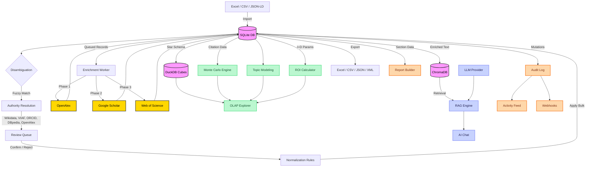

<div align="center">

# UKIP

**Universal Knowledge Intelligence Platform**

[](https://www.python.org/)
[](https://fastapi.tiangolo.com/)
[](https://react.dev/)
[](https://nextjs.org/)
[](https://tailwindcss.com/)
[](https://duckdb.org/)
[](https://www.trychroma.com/)
[](backend/tests/)
[](LICENSE)

A domain-agnostic intelligence platform that ingests raw data, harmonizes it, enriches it against global knowledge bases, runs OLAP analytics and stochastic simulations, and lets you query everything through a RAG-powered AI assistant.

[Features](#features) · [Quick Start](#quick-start) · [Architecture](#architecture) · [API](#api-overview) · [Roadmap](#roadmap) · [Strategic Vision](docs/EVOLUTION_STRATEGY.md)

</div>

---

## Why UKIP?

Most data platforms force you to choose: clean your data **or** analyze it. UKIP does both in a single pipeline. It started as a catalog deduplication tool and evolved into a full research intelligence engine across 37 development sprints.

**What it does:**

1. **Ingest** any structured data (Excel, CSV, JSON-LD, XML, BibTeX, RIS, Parquet).
2. **Harmonize** messy records with fuzzy matching, authority resolution against 5 global knowledge bases (Wikidata, VIAF, ORCID, DBpedia, OpenAlex), and bulk normalization rules.
3. **Enrich** every record against academic APIs (OpenAlex, Google Scholar, Web of Science).
4. **Analyze** with OLAP cubes (DuckDB), Monte Carlo simulations, topic modeling, correlation analysis, and I+D ROI projections.
5. **Query** your entire dataset in natural language through a RAG assistant powered by any LLM provider.
6. **Observe** every action through a real-time activity feed, audit log, and outbound webhooks.

### Design Philosophy

One rule: **Justified Complexity** ([details](docs/ARCHITECTURE.md)).

- Monorepo (FastAPI + Next.js). No microservices until proven necessary.
- If a dictionary solves it, we use a dictionary.
- Accessible for beginners, robust for production data tasks.

---

## Features

### Data Operations
- **Entity Catalog** — Browse, search, inline-edit, and delete records across any domain. Dynamic pagination, structured identifier fields.
- **Entity Detail Page** — Dedicated route (`/entities/:id`) with three tabs: Overview (inline editing), Enrichment (Monte Carlo chart + concepts), and Authority (candidate review with confirm/reject).
- **Multi-format Import/Export** — Excel, CSV, JSON, XML. Drag-and-drop pre-analyzer for JSON-LD, RDF, Parquet, BibTeX, RIS.
- **Domain Registry** — Define custom schemas (Science, Healthcare, Business, or your own) with YAML-based configurations.

### Data Quality
- **Fuzzy Disambiguation** — `token_sort_ratio` + Levenshtein grouping of typos, casings, and synonyms.
- **Authority Resolution Layer** — Resolve entities against Wikidata, VIAF, ORCID, DBpedia, and OpenAlex. Weighted scoring engine ranks candidates by confidence. Batch resolution with review queue for bulk confirm/reject workflows.
- **Harmonization Pipeline** — Multi-step normalization with undo/redo history and change tracking.

### Analytics
- **OLAP Cube Explorer** — DuckDB-powered multi-dimensional queries with drill-down navigation and Excel pivot export.
- **Monte Carlo Citation Projections** — Geometric Brownian Motion model simulates 5,000 citation trajectories per record. Interactive area charts.
- **ROI Calculator** — Monte Carlo I+D projection engine. Models adoption uncertainty (Normal distribution, configurable σ) across 3–20 year horizons. Returns P5–P95 percentiles, break-even probability, year-by-year ROI trajectory, and final distribution histogram.
- **Topic Modeling** — Concept frequency, co-occurrence (PMI), topic clusters, and Cramér's V field correlations.
- **Report Builder** — Self-contained, print-ready HTML reports generated server-side. Select any combination of sections: entity stats, enrichment coverage, top brands, topic clusters, harmonization log.

### Scientometric Enrichment
Three-phase cascading enrichment worker:

| Phase | Source | Access |
|-------|--------|--------|
| 1 | [OpenAlex](https://openalex.org/) | Free (polite `mailto:` mode) |
| 2 | Google Scholar | Scraping via rotating proxies |
| 3 | [Web of Science](https://clarivate.com/) | BYOK (institutional API key) |

### Semantic RAG Assistant
- **6 LLM providers** with BYOK support:

  | Provider | Models |
  |----------|--------|
  | OpenAI | gpt-4o, gpt-4o-mini |
  | Anthropic | claude-3.5-sonnet, claude-3-haiku |
  | DeepSeek | deepseek-chat, deepseek-reasoner |
  | xAI | grok-3, grok-3-mini |
  | Google | gemini-2.0-flash, gemini-pro |
  | Local | Any Ollama/vLLM model (free) |

- **ChromaDB** vector store with OpenAI or local `all-MiniLM-L6-v2` embeddings.
- Natural language queries return grounded, source-attributed answers with similarity scores.

### Observability & Automation
- **Activity Feed** — Real-time audit timeline on the home dashboard. Every upload, edit, harmonization, and authority action is logged with actor, timestamp, and context. Auto-refreshes every 30 seconds.
- **Webhooks** — Outbound HTTP callbacks for any platform event. HMAC-SHA256 request signing, per-event subscription, fire-and-forget delivery with status tracking. Configurable from the Settings panel (admin+).
- **Audit Log** — Persistent `AuditLog` table records actor, entity type, entity ID, and structured details for every mutating operation.

### Security
- **JWT authentication** with bcrypt password hashing.
- **Role-based access control** — `super_admin`, `admin`, `editor`, `viewer`.
- **Account lockout** after 5 failed login attempts (15-minute lockout window).
- **AES encryption** for sensitive credentials at rest.
- **Circuit breaker** pattern for external API resilience (CLOSED/OPEN/HALF-OPEN states).

### Interface
- **Responsive UI** — Full mobile support with slide-over sidebar drawer, hamburger navigation, and adaptive layouts from 320 px to 4K.
- **Dark mode** — System-aware theme with manual toggle.
- **i18n** — English and Spanish interface with per-component translation keys.

---

## Tech Stack

| Layer | Technology |
|-------|------------|
| **API** | Python 3.10+, FastAPI, SQLAlchemy ORM |
| **Database** | SQLite (OLTP), DuckDB (OLAP cubes), ChromaDB (vectors) |
| **Matching** | thefuzz + python-Levenshtein |
| **Enrichment** | openalex-py, scholarly, httpx |
| **Analytics** | numpy, scipy, DuckDB SQL (CUBE/ROLLUP/GROUPING SETS) |
| **NLP** | LDA topic modeling, sentence-transformers |
| **AI/RAG** | openai, anthropic, ChromaDB, sentence-transformers |
| **Frontend** | Next.js 16, React 19, TypeScript 5, Tailwind CSS 4, Recharts |

---

## Quick Start

### Prerequisites
- [Python 3.10+](https://www.python.org/downloads/)
- [Node.js 18+](https://nodejs.org/)

### 1. Clone and install

```bash
git clone https://github.com/keilynrp/universal-knowledge-intelligence-platform.git
cd universal-knowledge-intelligence-platform
```

### 2. Backend

```bash
python -m venv .venv

# Windows
.venv\Scripts\activate
# macOS / Linux
source .venv/bin/activate

pip install -r requirements.txt
uvicorn backend.main:app --reload
```

API at `http://localhost:8000` — Swagger UI at `http://localhost:8000/docs`

### 3. Frontend

```bash
cd frontend
npm install
npm run dev
```

Open `http://localhost:3004`

### 4. (Optional) Configure providers

- **AI Assistant**: Go to **Integrations > AI Language Models** and add your API key. For zero-cost: install [Ollama](https://ollama.ai) and point to `http://localhost:11434/v1`.
- **Web of Science**: Set `WOS_API_KEY` as an environment variable.
- **Webhooks**: Go to **Settings > Webhooks** to register outbound endpoints and subscribe to events.

### 5. Run tests

```bash
python -m pytest backend/tests/ -x -q
# 470+ tests, all passing
```

---

## Architecture



---

## API Overview

97+ endpoints across 14 functional groups. Full interactive docs at `/docs` (Swagger) or `/redoc`.

### Authentication & Users
| Method | Endpoint | Description |
|--------|----------|-------------|
| `POST` | `/auth/token` | Login (OAuth2 password flow) |
| `GET` | `/users/me` | Current user profile |
| `POST` | `/users` | Create user (super_admin) |
| `POST` | `/users/me/password` | Change password |

### Entity Catalog
| Method | Endpoint | Description |
|--------|----------|-------------|
| `GET` | `/entities` | List entities (search, pagination, filters) |
| `GET` | `/entities/{id}` | Single entity detail |
| `POST` | `/upload` | Import file (Excel, CSV) |
| `GET` | `/stats` | Aggregated system statistics |
| `GET` | `/export` | Export data (CSV, Excel, JSON, XML) |

### Domains & Schema Registry
| Method | Endpoint | Description |
|--------|----------|-------------|
| `GET` | `/domains` | List available domains |
| `POST` | `/domains` | Create custom domain schema |
| `DELETE` | `/domains/{id}` | Delete custom domain (built-ins protected) |

### Disambiguation & Harmonization
| Method | Endpoint | Description |
|--------|----------|-------------|
| `GET` | `/disambiguate/{field}` | Fuzzy-match groups for a field |
| `POST` | `/harmonization/apply` | Apply harmonization step |
| `POST` | `/harmonization/undo` | Undo last harmonization |
| `POST` | `/rules/apply` | Apply normalization rules |

### Authority Resolution
| Method | Endpoint | Description |
|--------|----------|-------------|
| `POST` | `/authority/resolve` | Resolve value against authority sources |
| `GET` | `/authority/records` | List authority candidates with filters |
| `POST` | `/authority/records/{id}/confirm` | Confirm candidate |
| `POST` | `/authority/records/{id}/reject` | Reject candidate |
| `GET` | `/authority/metrics` | ARL scoring and pipeline KPIs |

### OLAP & Analytics
| Method | Endpoint | Description |
|--------|----------|-------------|
| `GET` | `/cube/dimensions/{domain}` | Available OLAP dimensions |
| `POST` | `/cube/query` | Multi-dimensional cube query |
| `GET` | `/cube/export/{domain}` | Export pivot table to Excel |
| `GET` | `/analyzers/topics/{domain}` | Concept frequency and co-occurrence |
| `GET` | `/analyzers/clusters/{domain}` | Topic cluster analysis |
| `GET` | `/analyzers/correlation/{domain}` | Cramér's V field correlations |
| `POST` | `/analytics/roi` | Monte Carlo I+D ROI simulation |

### Scientometric Enrichment
| Method | Endpoint | Description |
|--------|----------|-------------|
| `POST` | `/enrich/bulk` | Queue bulk enrichment |
| `GET` | `/enrich/stats` | Enrichment KPIs and concept cloud |
| `GET` | `/enrich/montecarlo/{id}` | Monte Carlo 5-year citation projection |

### Semantic RAG
| Method | Endpoint | Description |
|--------|----------|-------------|
| `POST` | `/rag/index` | Vectorize catalog into ChromaDB |
| `POST` | `/rag/query` | Natural language query |
| `GET` | `/rag/stats` | Vector store statistics |

### Report Builder
| Method | Endpoint | Description |
|--------|----------|-------------|
| `GET` | `/reports/sections` | List available report sections |
| `POST` | `/reports/generate` | Generate and download HTML report |

### Audit & Activity
| Method | Endpoint | Description |
|--------|----------|-------------|
| `GET` | `/audit/feed` | Paginated audit event timeline |

### Webhooks
| Method | Endpoint | Description |
|--------|----------|-------------|
| `GET` | `/webhooks` | List configured webhooks |
| `POST` | `/webhooks` | Register a new webhook |
| `PUT` | `/webhooks/{id}` | Update webhook (url, events, secret) |
| `DELETE` | `/webhooks/{id}` | Remove webhook |
| `POST` | `/webhooks/{id}/test` | Send a test ping to endpoint |

### AI Provider Management
| Method | Endpoint | Description |
|--------|----------|-------------|
| `GET` | `/ai-integrations` | List configured LLM providers |
| `POST` | `/ai-integrations` | Add provider (BYOK) |
| `POST` | `/ai-integrations/{id}/activate` | Set active RAG provider |

---

## Project Structure

<details>
<summary>Click to expand</summary>

```
ukip/
├── backend/
│   ├── adapters/
│   │   ├── enrichment/           # OpenAlex, Scholar, WoS adapters
│   │   └── llm/                  # OpenAI, Anthropic, Local LLM adapters
│   ├── analytics/
│   │   ├── montecarlo.py         # Stochastic citation projections
│   │   ├── rag_engine.py         # RAG orchestration (index + query)
│   │   └── vector_store.py       # ChromaDB vector store
│   ├── analyzers/
│   │   ├── topic_modeling.py     # Concept frequency, co-occurrence, PMI
│   │   ├── correlation.py        # Cramér's V multi-variable analysis
│   │   └── roi_calculator.py     # Monte Carlo I+D ROI simulation (numpy)
│   ├── authority/
│   │   ├── resolver.py           # Parallel authority resolution engine
│   │   ├── scoring.py            # Weighted scoring & evidence
│   │   └── resolvers/            # Wikidata, VIAF, ORCID, DBpedia, OpenAlex
│   ├── domains/
│   │   ├── default.yaml          # Universal catalog schema
│   │   ├── science.yaml          # Scientific domain
│   │   └── healthcare.yaml       # Healthcare domain
│   ├── tests/                    # 470+ tests across 26+ files
│   ├── auth.py                   # JWT + RBAC + account lockout
│   ├── circuit_breaker.py        # External API resilience
│   ├── encryption.py             # AES encryption utilities
│   ├── main.py                   # FastAPI app (97+ endpoints)
│   ├── models.py                 # SQLAlchemy ORM models (incl. AuditLog, Webhook)
│   ├── olap.py                   # DuckDB OLAP engine
│   ├── report_builder.py         # HTML report generation (5 section builders)
│   └── schema_registry.py        # Dynamic domain schema loader
├── frontend/
│   ├── app/
│   │   ├── analytics/
│   │   │   ├── olap/             # OLAP Cube Explorer
│   │   │   ├── topics/           # Topic Modeling & Correlations
│   │   │   ├── roi/              # ROI Calculator (Monte Carlo I+D)
│   │   │   └── page.tsx          # Intelligence Dashboard
│   │   ├── authority/            # Disambiguation + Review Queue
│   │   ├── domains/              # Domain schema management
│   │   ├── entities/
│   │   │   └── [id]/             # Entity Detail Page (3-tab view)
│   │   ├── harmonization/        # Data cleaning workflows
│   │   ├── integrations/         # Store + AI provider config
│   │   ├── rag/                  # Semantic RAG chat
│   │   ├── reports/              # Report Builder
│   │   ├── settings/             # App settings + user management + webhooks
│   │   ├── components/
│   │   │   ├── ActivityFeed.tsx  # Real-time audit timeline
│   │   │   ├── EntityTable.tsx   # Entity list with detail links
│   │   │   ├── MonteCarloChart.tsx
│   │   │   ├── RAGChatInterface.tsx
│   │   │   └── ui/               # Shared design system components
│   │   └── login/                # Authentication
│   └── lib/                      # API client, utilities
├── docs/
│   ├── ARCHITECTURE.md           # Design patterns & philosophy
│   ├── EVOLUTION_STRATEGY.md     # Long-term platform vision
│   └── SCIENTOMETRICS.md         # Enrichment strategy
└── requirements.txt
```

</details>

---

## Roadmap

### Completed

| Sprint | Milestone |
|--------|-----------|
| 1–5 | Core catalog, fuzzy disambiguation, multi-format import/export, analytics dashboard |
| 6–8 | Scientometric enrichment (OpenAlex, Scholar, Web of Science), circuit breaker |
| 9 | Monte Carlo stochastic citation projections |
| 10 | Semantic RAG with ChromaDB + multi-LLM BYOK panel |
| 11–13 | E-commerce integrations (Shopify, WooCommerce, Bsale); HTTP 201 on creation; export/upload caps |
| 14 | Security hardening: JWT auth on all endpoints, RBAC, account lockout, password management, role-aware UI |
| 15–16 | Authority Resolution Layer with weighted scoring engine (Wikidata, VIAF, ORCID, DBpedia, OpenAlex); ARL metrics endpoint |
| 17a | Domain Registry with YAML-based schema designer |
| 17b | OLAP Cube Explorer powered by DuckDB (multi-dimensional queries, drill-down, Excel pivot export) |
| 18 | Topic modeling, PMI co-occurrence networks, topic clusters, Cramér's V correlation analysis |
| 19 | ARL Phase 2: batch resolution, review queue, bulk confirm/reject, `GET /authority/metrics` |
| 20–22 | Webhook system (HMAC-SHA256 signing, per-event subscription, delivery tracking); Audit Log + Activity Feed (30-second auto-refresh); responsive UI (mobile sidebar drawer, hamburger navigation, adaptive layouts) |
| 23 | Entity Detail Page (`/entities/:id`) with 3 tabs: Overview (inline editing), Enrichment (Monte Carlo + concepts), Authority (candidate confirm/reject) |
| 36 | Report Builder — server-side HTML generation per domain with section toggles, print/PDF support |
| 37 | ROI Calculator — Monte Carlo I+D projection with P5–P95 percentiles, break-even probability, year-by-year trajectory charts, distribution histogram, CSV export |

### Up Next

| Priority | Feature |
|----------|---------|
| High | **Context Engineering Layer** — Structured LLM context builder with tool registry and persistent memory |
| High | **Bulk Entity Editor** — Multi-select and batch-edit fields across filtered result sets |
| Medium | **Knowledge Gap Analyzer** — Bibliometric gap detection across research corpora |
| Medium | **Scopus Adapter** — Elsevier premium enrichment (BYOK) |
| Medium | **Scheduled Imports** — Automated ingestion from S3 / external APIs |
| Low | **PostgreSQL/MySQL backends** — Production-grade database support |
| Low | **SSO Integration** — OAuth2/SAML for institutional deployments |

See [EVOLUTION_STRATEGY.md](docs/EVOLUTION_STRATEGY.md) for the full platform vision and phased roadmap.

---

## Contributing

Contributions are welcome. See [Contributing Guidelines](docs/CONTRIBUTING.md) for details.

## License

[Apache License 2.0](LICENSE)
